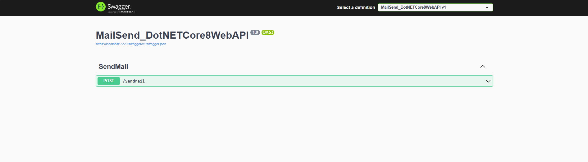

# MailSend_DotNETCore8WebAPI

A simple .NET Core 8 Web API project to send emails with attachments using MailKit and MimeKit.

## Features

- Send emails with subject and body
- Attach multiple files to the email
- Configurable SMTP settings

## Swagger Interface

- Post method 

  

- Add Informations

  

- Response
  

  

  

